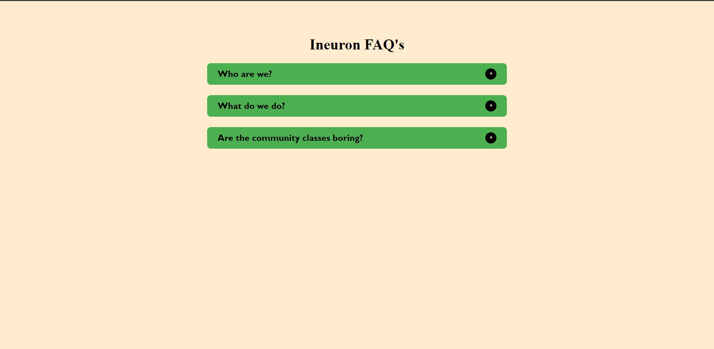
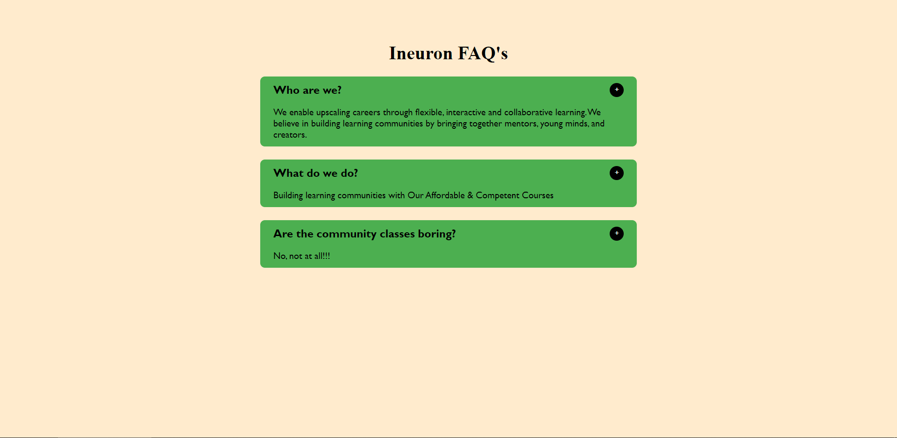

# Accordion - JavaScript Project

## Murtuza Rangwala

- This is Javascript Project. In this project I have made a **ineuron Accordion** with JavasCript.

- It took me almost 3 hrs to make this project. Please find the link below.

  [Live Link Of Project](https://mk-accordion.netlify.app/)

---

## 🛠 Skills learned

- JavaScript
- To Use DOM
- Creating Elements in Javascript
- Adding Elements in HTML using JavaScript
- Adding Attributes to the Elements

---

## 🎥 Output

---
