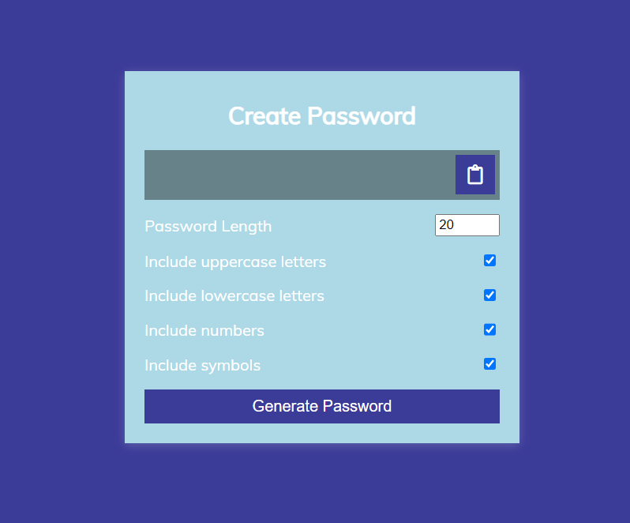
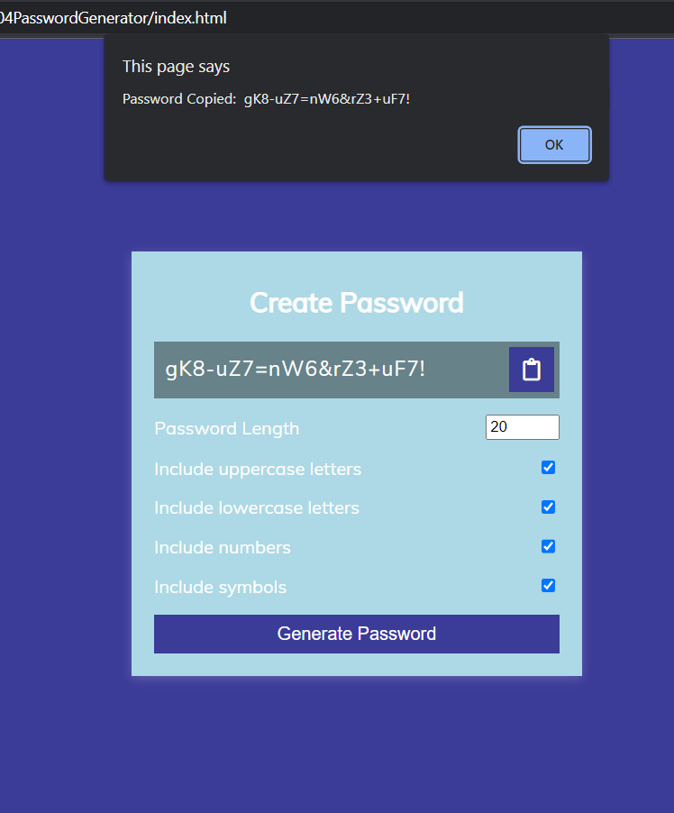

# Password Generator - JavaScript Project

## Murtuza Rangwala

- This is Javascript Project. In this project I have made a **Password Generator** with JavasCript.

- It took me almost 3 hours to make this project. Please find the link below.

  [Live Link Of Project](https://mk-password-generator.netlify.app/)

---

## 🛠 Skills learned

- JavaScript
- To Use DOM
- Adding Event Listener

---

## 🎥 Output

---
