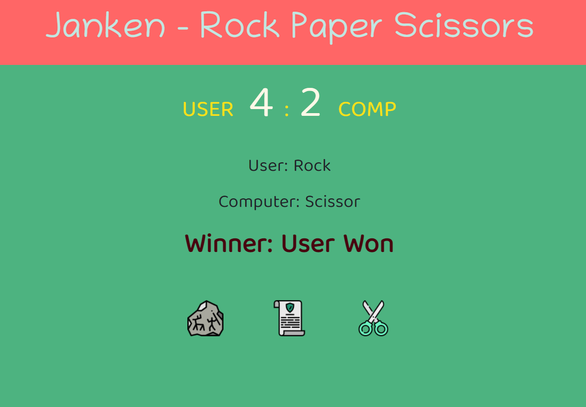

# Rock-Paper-Scissor Game - JavaScript Project

## Murtuza Rangwala

- This is Javascript Project. In this project I have made a **Rock-Paper-Scissor Game** with JavasCript.

- It took me almost 4 hours to make this project. Please find the link below.

  [Live Link Of Project](https://janken-rock-paper-scissor.netlify.app/)

---

## 🛠 Skills learned

- JavaScript
- To Use DOM
- Adding Event Listener

---

## 🎥 Output

---
