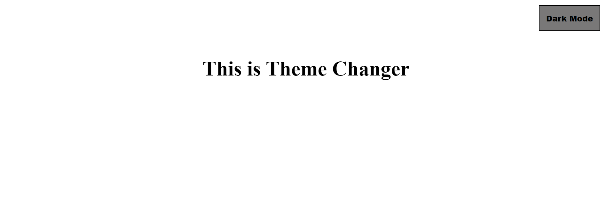
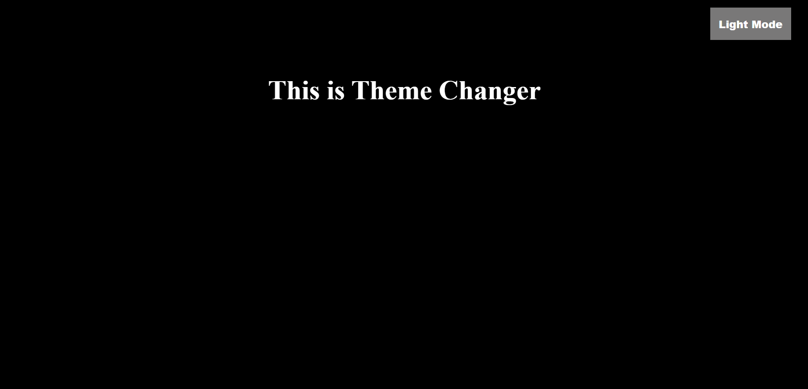

# Theme Changer - JavaScript Project

## Murtuza Rangwala

# JavaScript Accordion

- This is Javascript Project. In this project I have made a **Theme Changer** with JavasCript.

- It took me almost 1 hrs to make this project. Please find the link below.

  [Live Link Of Project](https://mk-basic-theme.netlify.app/)

---

## 🛠 Skills learned

- JavaScript
- To Use DOM

---

## 🎥 Output

---
